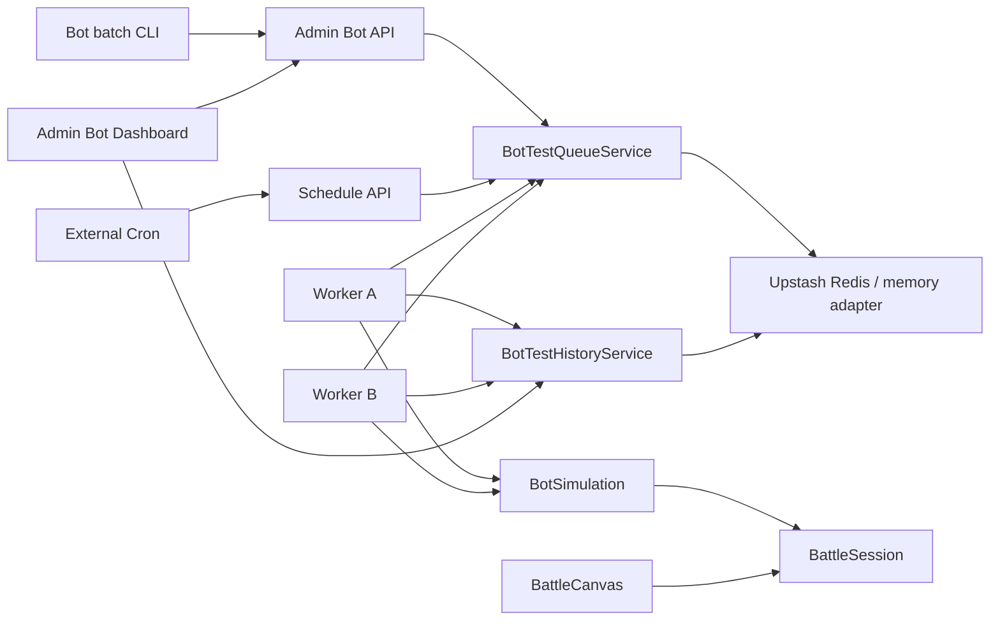

# 128 API駆動Botテスト運用拡張設計

> 作成日: 2026-07-27  
> 関連: [127_API駆動Botテスト基盤設計.md](127_API駆動Botテスト基盤設計.md) / [122_無限ダンジョン設計.md](122_無限ダンジョン設計.md)

## 1. 目的

API駆動Botテスト基盤を、一回限りのローカル調査から継続運用できるバランス観測基盤へ拡張する。
対象には第1章だけでなく「黄泉の階層」B1〜B20を含め、履歴比較、任意ビルド感度分析、分散実行、定期実行、管理画面による可視化までを同じデータモデルで扱う。

## 2. 決定事項

1. 黄泉は `yomi` スイートとして独立させ、深度帯 `B1-5 / B6-10 / B11-15 / B16-20` を集計軸にする。
2. 黄泉の敵能力は必ず各WAVEの `statScale` 適用後の実効値で戦闘する。
3. UI戦闘とヘッドレス戦闘は `BattleSession` のWAVE構築・敵複製・標的優先規則を共有する。表示状態とVFXは `BattleCanvas` に残す。
4. 任意ビルドは職業、レベル、死霊術レベル、武器、軍団3枠、残滓5枠をAPI入力で上書きできる。
5. 感度分析は基準ビルドの各指定ステータスを一定割合だけ増減し、同一seed群で差分を比較する。
6. 履歴・キュー・スケジュールはUpstash Redis RESTを永続ストアとする。Redis未設定の開発・Jestでは同じインターフェースのインメモリ実装を使う。
7. 分散ワーカーはHTTP APIからキューをclaimし、一つのjobを一つのワーカーだけが処理する。job lease期限後は再取得可能にする。
8. 定期実行は外部Cronから保護されたHTTP endpointを起動し、有効なスケジュールをキューへ投入する。ゲーム本体のユーザーデータには書き込まない。

## 3. システム構成



## 4. 黄泉テストケース

### 4.1 スイート

| suite | 対象 |
|---|---|
| `chapter1` | chapter=1かつ黄泉を除く戦闘ステージ |
| `yomi` | `yomi_b01`〜`yomi_b20` |
| `all` | 全戦闘ステージ |

黄泉は節目階B5/B10/B15/B20と各帯の通常階を全て対象にする。`chapter=1`だけで選別すると黄泉まで混入するため、ID prefixで明示的に分離する。

### 4.2 プロファイル

既存4プロファイルに `yomi_entry` と `yomi_deep` を追加する。

| profile | Job Lv | Necro Lv | 用途 |
|---|---:|---:|---|
| `yomi_entry` | 25 | 60 | B1〜B10への初回進入想定 |
| `yomi_deep` | 50 | 200 | B11〜B20の深部攻略想定 |

### 4.3 判定

- クリア率、95% Wilson区間、P50/P95ラウンド、残HP、与被ダメージを階別・深度帯別に比較する。
- 黄泉は通常ドロップが空で初回確定報酬が中心のため、`firstClear=true` ケースを標準に含める。
- B5/B10/B15/B20では素材、武器素材、残滓の確定観測も検証する。

## 5. BattleSession共通化

`src/logic/BattleSession.ts` を純粋な共有境界とする。

- `buildWaves(stage, enemyLookup)`: 参照検証、`statScale`適用、敵のdeep copy、WAVE報酬配分。
- `pickTarget(candidates, accessors)`: 生存、tier優先、残HP優先の決定的な標的選択。
- ヘッドレス実行器は上記のWAVEを `BattleEngine` runtimeへ変換する。
- `BattleCanvas`は同じWAVEを表示用 `EnemyState`へ変換する。

この境界により、黄泉の `statScale` を片方だけが無視するドリフトを防ぐ。アニメーション、入力待ち、AV表示などUI固有状態は共通化対象外とする。

## 6. 任意ビルドと感度分析

### 6.1 build入力

```ts
type BotBuildOverrides = {
  jobLevel?: number;
  necroLevel?: number;
  weaponId?: string;
  partyMonsterIds?: string[]; // 最大3、コスト上限検証
  residues?: Array<{
    mainStat: { type: string; value: number };
    subOptions?: Array<{ type: string; value: number }>;
  }>; // 最大5
};
```

残滓は所持品IDではなく効果値を入力する。ランダム生成物である残滓に固定マスターIDが存在しないためである。能力反映には製品コードと同じ `calculateCharacterStatProfile` を用いる。

### 6.2 sensitivity入力

`stats`（HP/ATK/DEF/SPD/会心率/会心ダメージ等）と `deltasPct`（例: -10,-5,5,10）を受け、基準ケースと同一seedでvariantを実行する。出力はclear rate、P95ラウンド、残HPの基準差分を含む。

## 7. 履歴・前回差分

履歴は完全なrun logではなく、管理画面に必要な集約値を保存する。既定保持件数は100 batch、TTLは90日。

```ts
type BotTestHistoryEntry = {
  id: string;
  batchId?: string;
  suite: 'chapter1' | 'yomi' | 'all' | 'custom';
  generatedAt: string;
  seed: string;
  totals: { scenarios; simulations; wins; losses; timeouts };
  scenarios: Array<{ stageId; profile; policy; jobId; clearRate; roundsP95; warnings }>;
  comparison?: { previousId; clearRateDelta; roundsP95Delta; regressions: string[] };
};
```

前回差分は同じsuiteの直前履歴を比較対象にする。同じ `stageId/profile/policy/jobId` のキー同士で比較し、クリア率低下またはP95増加をregressionとして列挙する。

## 8. Redisキュー

### 8.1 キー

- `bot-test:queue`: 待機job IDのLIST
- `bot-test:job:{id}`: job JSON
- `bot-test:batch:{id}`: batch JSON
- `bot-test:history`: history IDのLIST
- `bot-test:history:{id}`: history JSON
- `bot-test:schedules`: schedule JSON

### 8.2 状態遷移

`QUEUED -> RUNNING -> COMPLETED | FAILED`。claim時に `leaseUntil` を設定する。期限切れRUNNING jobは再投入できる。job結果をbatchへ集約し、全job終端時に履歴を一度だけ生成する。

Redis commandはUpstash `/pipeline` を利用する。claimは `RPOP` で一意に取得し、メモリ実装でも同じ遷移を保証する。

## 9. API

| method/path | 用途 |
|---|---|
| `GET /api/admin/bot-simulate` | stage suiteを含むカタログ |
| `POST /api/admin/bot-simulate` | 同期シナリオ実行 |
| `POST /api/admin/bot-sensitivity` | 同期感度分析 |
| `GET/POST /api/admin/bot-history` | 履歴取得・バッチ結果登録 |
| `GET/POST /api/admin/bot-jobs` | batch状態取得・分散batch投入 |
| `POST /api/admin/bot-worker` | job claim・実行 |
| `GET/PUT /api/admin/bot-schedules` | スケジュール取得・更新 |
| `POST /api/cron/bot-tests` | 期限到来scheduleをenqueue |

admin APIは既存のBot Bearer token規則、cron APIは `CRON_SECRET` を用いる。本番ではRedis未設定時にキュー・履歴・schedule APIを503とし、揮発運用へ黙ってfallbackしない。

## 10. 管理画面

`/admin/bot-tests` に以下を表示する。

- suite別の最新clear rate、P95、警告数
- 履歴推移SVGグラフ
- stage別の前回差分とregression一覧
- chapter1 / yomi batch投入ボタン
- worker実行ボタンとqueue進捗
- 定期実行の有効化、間隔、iterations設定

Gothic-MorphismのVoid Purple、Obsidian Glass、Cinzel/Space Mono、bone/parchment色を使い、管理用途なので数値可読性を優先する。

## 11. 障害・再実行

- API requestは500 iterations上限を維持する。
- worker失敗はerrorをjobへ保存し、batchは他jobの完了を継続する。
- history保存失敗でシミュレーション結果自体を失敗扱いにしない。
- 同一scheduleは `lastEnqueuedAt` と `intervalMinutes` で重複投入を抑止する。
- seedはbatch IDから派生させ、再実行時はhistoryに記録されたseedを指定できる。

## 12. テスト戦略

1. `BattleSession`: statScale、未知enemy、target優先。
2. `BotSimulation`: YOMI catalog/profile、任意build、残滓反映、感度分析の再現性。
3. `BotTestHistoryService`: 前回差分、保持上限、suite分離。
4. `BotTestQueueService`: enqueue/claim/complete/fail、batch集約、lease回収。
5. Route: auth、validation、正常系、cron secret。
6. 統合スモーク: YOMI B1/B10/B20、同期API、queue worker、history、admin build。

