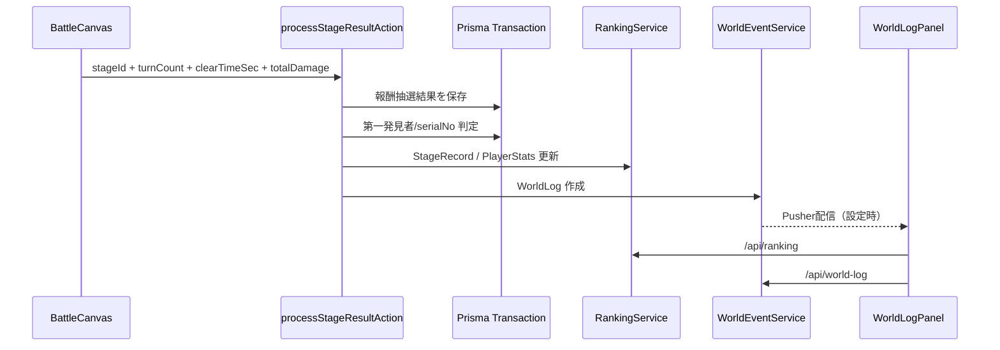

# 36_オンライン機能実装設計

> 作成日: 2026-05-17  
> 対象: CH1 Phase D / クラウドセーブ・ランキング・第一発見者・世界ログ

## 目的

第1章リリースに必要なオンライン機能を、ログイン済みプレイヤーのステージクリア結果へ接続する。未ログイン時や外部サービス未設定時もローカルプレイが壊れないよう、オンライン機能は「保存できる時に保存し、取得できる時に同期する」構成にする。

## 実装スコープ

| 項目 | 実装 |
|---|---|
| クラウドセーブ | `processStageResultAction(stageId, meta)` で報酬抽選、武器・残滓保存、経験値、クリアフラグをDBへ反映 |
| ランキング | `StageRecord` と `PlayerStats` を追加し、`/api/ranking` で取得 |
| 第一発見者 | `ItemSerialCounter` と `Item.discoverer*` を使い、SSR/UR/LR/ユニーク武器の初発見を記録 |
| 世界ログ | `WorldLog` をDBに永続化し、Pusher Channels が設定されていればライブ配信 |
| UI | `LOGS` タブに `世界` セグメントを追加し、ランキングと世界ログを表示 |

## データフロー



## Server Actions

`src/app/actions.ts`

- `processStageResultAction(stageId, meta)` をオンライン記録の入口にする。
- `meta` は `turnCount`, `clearTimeSec`, `totalDamage` を受け取る。
- セッションがない場合はDB保存せず、従来通りサーバー側のドロップ抽選結果だけ返す。
- セッションがある場合は `Prisma.$transaction` 内で以下を処理する。
  - `Item.ownerId` 付きで武器保存
  - `AbyssalResidue.characterId` 付きで残滓保存
  - `UserJob` の経験値/レベル更新
  - `Character.clearedStages` 更新
  - `StageRecord` / `PlayerStats` 更新
  - 第一発見者イベント、ボス初討伐イベント、残滓ランキング更新イベントを `WorldLog` へ作成

## 第一発見者

対象は以下の武器。

- SSR
- UR
- LR
- UNIQUE / HIDDEN_UNIQUE
- `isUnique = true`

判定は `Item.name + Item.rarity` に discoverer が存在するかで行う。対象武器は `ItemSerialCounter.itemName` をインクリメントし、ドロップ個体に `serialNo` を付与する。初発見の場合のみ `discovererId`, `discovererName`, `discoveredAt` を保存し、世界ログを発火する。

Hidden drop は `RewardService.processDropTable` で抽選対象に戻した。これによりドロップテーブル上のUR/ユニーク武器も実際に排出される。

## ランキング

`src/services/RankingService.ts`

| 種別 | 参照 |
|---|---|
| `STAGE_TIME` | `StageRecord.turnCount` → `clearTimeSec` 昇順 |
| `TOTAL_DAMAGE` | `PlayerStats.totalDamage` 降順 |
| `BOSS_KILLS` | `PlayerStats.bossKillCount` 降順 |
| `RESIDUE_SCORE` | `PlayerStats.bestResidueScore` 降順 |

Upstash Redis は任意。`UPSTASH_REDIS_REST_URL` と `UPSTASH_REDIS_REST_TOKEN` がない場合はDB直読みで動作する。

## 世界ログ

`src/services/WorldEventService.ts`

- `WorldLog` は必ずDBに保存する。
- Pusher環境変数がある場合のみREST APIで `world-log` チャンネルへ配信する。
- Pusher配信失敗はゲーム進行を止めない。

必要な環境変数:

```bash
PUSHER_APP_ID=
NEXT_PUBLIC_PUSHER_KEY=
PUSHER_SECRET=
NEXT_PUBLIC_PUSHER_CLUSTER=
```

`src/hooks/useWorldLog.ts`

- 初回と30秒ごとに `/api/world-log` から取得する。
- `NEXT_PUBLIC_PUSHER_KEY` と `NEXT_PUBLIC_PUSHER_CLUSTER` がある場合はブラウザの `WebSocket` でPusher Channelsを購読し、ライブイベントを即時挿入する。

## UI/UX

`src/components/social/WorldLogPanel.tsx`

- Gothic-Morphism のガラスパネルで `WORLD LINK` を表示。
- 上部に同期状態を表示する。
- ランキングは `残滓スコア` と `竜骨祭壇最速` の2枚を優先表示する。
- 世界ログはUR/SSR/ボス初討伐/ランキング更新でアイコンと色を切り替える。
- iOS想定で `flex-1 min-h-0 overflow-y-auto` を徹底し、ログ一覧だけがスクロールする。

## フォールバック方針

| 状態 | 挙動 |
|---|---|
| 未ログイン | DB保存なし、報酬はローカル同等に返す |
| Prisma/Server Action失敗 | `BattleCanvas` がローカル抽選へフォールバック |
| Redis未設定 | DBからランキング取得 |
| Pusher未設定 | RESTポーリングのみ |
| Pusher配信失敗 | DB保存済みのため次回ポーリングで表示 |

## 変更ファイル

- `prisma/schema.prisma`
- `prisma/migrations/20260517000000_phase_d_online_features/migration.sql`
- `src/app/actions.ts`
- `src/app/api/ranking/route.ts`
- `src/app/api/world-log/route.ts`
- `src/services/RankingService.ts`
- `src/services/WorldEventService.ts`
- `src/hooks/useRanking.ts`
- `src/hooks/useWorldLog.ts`
- `src/components/social/WorldLogPanel.tsx`
- `src/components/battle/BattleCanvas.tsx`
- `src/app/page.tsx`
- `src/services/RewardService.ts`
