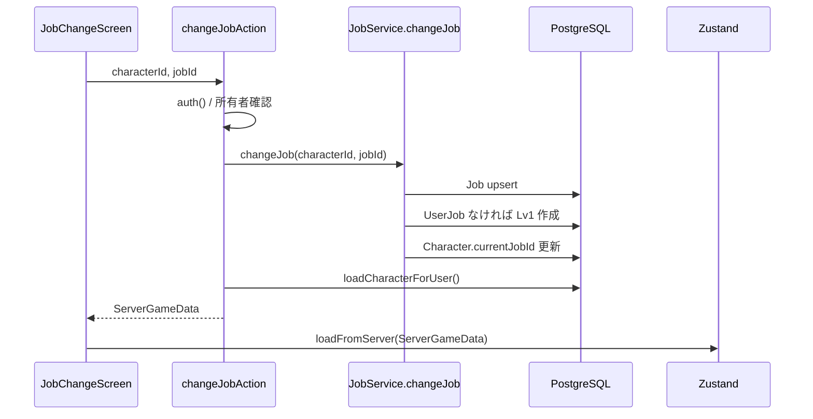

# 39_転職DB保存設計

## 目的

転職画面で選択した職業をクライアント内の Zustand 更新だけで終わらせず、オンラインゲーム状態の正本である PostgreSQL に保存する。  
リロード後、別端末ログイン後、バトル開始時のいずれでも `Character.currentJobId` と `UserJob` が一致した状態を保証する。

## 現状の問題

- `JobChangeScreen` は `useGameStore.changeJob(jobId)` のみを呼んでいた。
- `useGameStore.changeJob()` はステータス再計算と UI 更新を行うが DB を更新しない。
- そのため `loadCharacterForUser()` で再ロードすると、DB 上の `Character.currentJobId` に戻ってしまう。
- `UserJob` が未作成の職業へ転職した場合も、DB に Lv1 の職業行が作られない。

## 保存フロー

## DB更新仕様

- `Character.currentJobId`
  - 転職先 `jobId` に更新する。
- `UserJob`
  - 既に存在する場合はレベル/経験値を維持する。
  - 未経験の職業の場合は `{ level: 1, exp: 0 }` で作成する。
- `Job`
  - マスターデータに存在する職業を `upsert` して、`UserJob.jobId` の外部キーを満たす。

## バリデーション

- 未ログイン: `ログインが必要です`
- 所有していないキャラクター: `キャラクターが見つかりません`
- マスターデータに存在しない職業: `存在しない職業です`
- 解放条件未達成: `解放条件を満たしていません`

解放判定は UI と同じ `getJobUnlockStatus()` を使い、クライアント表示とサーバー保存の条件差分を作らない。

## UI仕様

- 転職ボタン押下時に `changeJobAction()` を呼ぶ。
- 成功時は Server Action から返る `ServerGameData` を `loadFromServer()` で反映する。
- 失敗時は画面内の警告枠に理由を表示し、ローカルだけの転職は行わない。
- 保存中はボタンを `転職中...` 表示にして二重送信を防ぐ。

## テスト方針

- 新規アカウント作成後、未経験職業へ転職すると `UserJob` が Lv1 で作られること。
- `Character.currentJobId` が DB に保存され、`loadCharacterForUser()` の戻り値にも反映されること。
- 既存職業へ戻っても、その職業の `UserJob` が維持されること。
