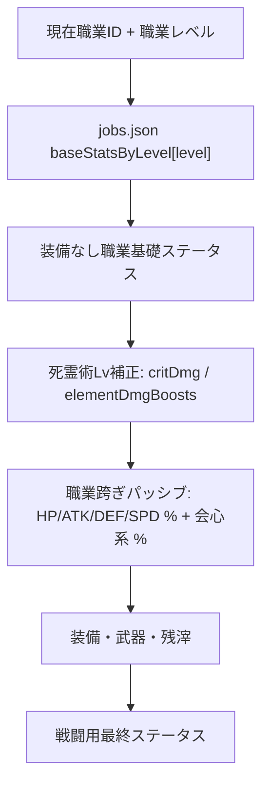

# 96. 主人公成長と職業基礎ステータス再設計

> 作成日: 2026-06-06  
> 対象: 主人公ステータス、死霊術レベル補正、職業レベルパッシブ、職業マスターデータ管理

## 背景

現行実装は、職業レベルアップ時に `Character.hp / atk / def` をDBへ直接加算し、転職時はそのDB値へ `job.statModifiers` を掛ける構造になっている。

この構造には次の問題がある。

- 同じキャラクター基礎値が、職業レベル成長・職業倍率・装備・死霊術補正の境界を曖昧にしている。
- 職業を跨いだ永続パッシブが実数値なので、序盤では強すぎ、後半では弱すぎる値になりやすい。
- `necroBaseStatsBonus` が主人公本人のHP/ATK/DEF/SPDへ大きく掛かるため、ゲームバランスが死霊術ランクで急膨張する。
- 管理画面から「主人公Lv1〜100の装備なし基礎ステータス」を職業別に直接管理できない。

## 目的

1. 主人公の装備なし基礎ステータスを、職業ごとの `baseStatsByLevel` 固定テーブルで管理する。
2. 職業レベルアップで獲得する職業跨ぎパッシブを、HP/ATK/DEF/SPDも含めてパーセンテージ補正として扱う。
3. 死霊術レベル補正は、10レベルごとに全属性ダメージ +1%、会心ダメージ +1% とする。
4. `necroBaseStatsBonus` は既存DB互換として残すが、主人公本人のステータス計算には使わない。
5. Tierが高い職業ほど、総合的な装備なし性能が高いことをデータ監査とテストで担保する。

## 非対象

- 使役モンスターの基礎ステータスへ死霊術補正を掛ける実装は、今回まだ行わない。
- Prismaスキーマのリネームや既存DBカラム削除は行わない。
- 職業経験値曲線そのものは既存の `ExperienceSystem` を維持する。

## 新しい計算順序



### 職業基礎ステータス

`jobs.json` の各職業に `baseStatsByLevel` を追加する。

```json
{
  "baseStatsByLevel": {
    "1": { "hp": 34, "atk": 5, "def": 5, "spd": 98, "critRate": 5, "critDmg": 158, "effectHit": 0, "effectRes": 0 },
    "2": { "...": "..." },
    "100": { "...": "..." }
  }
}
```

レベルは文字列キー `"1"` から `"100"` までを必須にする。未定義レベルが参照された場合は、実行時には近い有効レベルへクランプし、監査ではFAILとして検出する。

### レベルアップ時のDB更新

ステージクリア時の職業経験値更新では、`UserJob.exp / level` のみを更新する。`Character.hp / atk / def` の増分更新は廃止する。

理由は、装備なし基礎ステータスが `baseStatsByLevel` から導出されるため、DBへ二重に成長値を蓄積しないためである。

### 職業跨ぎパッシブ

既存の `passiveAtkBonus` などのDBカラム名は維持するが、意味を次のように変更する。

| フィールド | 新しい意味 |
|---|---|
| `passiveHpBonus` | 最大HP % |
| `passiveAtkBonus` | 攻撃力 % |
| `passiveDefBonus` | 防御力 % |
| `passiveSpdBonus` | 速度 % |
| `passiveCritRateBonus` | 会心率 % 加算 |
| `passiveCritDmgBonus` | 会心ダメージ % 加算 |

HP/ATK/DEF/SPDは現在の職業基礎ステータスへ割合で適用する。会心率と会心ダメージは従来通りパーセント値を直接加算する。

### 死霊術レベル補正

死霊術レベルは10レベルごとに補正段階を得る。

```ts
step = floor(necroLevel / 10)
allElementDamageBoost += step
critDmg += step
```

例:

| 死霊術Lv | 全属性ダメージ | 会心ダメージ |
|---:|---:|---:|
| 1〜9 | +0% | +0% |
| 10〜19 | +1% | +1% |
| 50〜59 | +5% | +5% |
| 99 | +9% | +9% |

`necroBaseStatsBonus` は今後、使役モンスターの基礎ステータス補正へ転用できる互換値として残す。主人公本人のHP/ATK/DEF/SPDには掛けない。

## 職業基礎ステータスのバランス方針

Lv1は既存の序盤バランスに合わせ、通常攻撃が4〜5ダメージ程度になる低い値を維持する。Lv100までの伸びは緩やかにし、装備とパッシブで差を作る。

Tier2職業はTier1より総合スコアが高くなるようにする。ただし、魔法職や高速職はHP/DEFが低いなど、個性として一部ステータスが下がることは許容する。

監査用の総合スコアは次のような簡易評価で扱う。

```ts
score =
  hp * 0.15 +
  atk * 3 +
  def * 2 +
  spd * 1 +
  critRate * 2 +
  critDmg * 0.5 +
  effectHit * 0.8 +
  effectRes * 0.8
```

## 管理画面

`/admin/jobs/[id]` の職業フォームに「基礎ステータス」タブを追加する。

- `baseStatsByLevel` をLv別の数値入力UIで編集できる。
- Lv100の最終ステータスを入力すると、Lv1の値を始点、Lv100の値を終点としてLv2〜99を自動補完する。
- 補完曲線は `ratio = 0.72t + 0.28t²` とし、序盤の伸びを抑えつつ終盤へ少しだけ伸びが増える緩やかな成長にする。
- Lv100編集時は該当ステータス列だけを自動補完し、中間レベルの手動調整を一括で整えたい場合は「Lv100から補完」で全ステータス列を再補完する。
- 保存時は既存の `saveEntry('jobs', ...)` 経由で `jobs.json` に保存する。
- 監査でLv1〜100の欠落、ステータスキー欠落、数値不正、Tier2総合スコアの極端な低下を検出する。

## 実装対象

| 領域 | 変更内容 |
|---|---|
| 型 | `JobData.baseStatsByLevel`, `CharacterData.necroLevel`, パッシブ%コメントを追加 |
| 成長ロジック | `getJobBaseStatsAtLevel()`, `calculateNecromanceLevelBonus()` を追加 |
| ステータス集計 | ネクロ基礎倍率を廃止し、死霊術Lvの属性/会心補正を適用 |
| サーバー | ロード・キャラ作成・ステージ結果・GameManagerの基礎値導出を固定表へ変更 |
| クライアント | Zustand初期化、ロード同期、転職、経験値追加で固定表を使う |
| 管理画面 | JobFormに `baseStatsByLevel` 編集タブを追加 |
| データ | 全職業にLv1〜100の `baseStatsByLevel` と%パッシブ値を設定 |
| テスト | 成長、ステータス、サーバー連携、管理監査、バランスのテストを更新 |

## テスト観点

1. 各職業にLv1〜100の基礎ステータスが存在する。
2. Lv1の剣士+初期武器は従来の序盤ダメージ帯を維持する。
3. ステージクリア後、DBの `Character.hp / atk / def` は増分更新されず、ロード結果は職業テーブルから導出される。
4. 職業パッシブはHP/ATK/DEF/SPDへ%として反映される。
5. 死霊術Lv10/50/99で、全属性ダメージと会心ダメージ補正が段階的に増える。
6. `necroBaseStatsBonus` を大きくしても、主人公本人の基礎HP/ATK/DEF/SPDは膨張しない。
7. 管理画面の職業フォームで `baseStatsByLevel` をJSON直接編集ではなく数値入力UIで読み書きできる。
8. マスターデータ監査で職業ステータス表の欠落・不正を検出できる。
